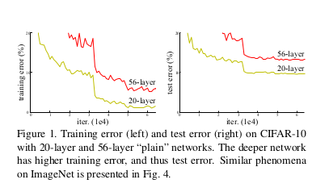
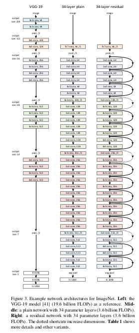
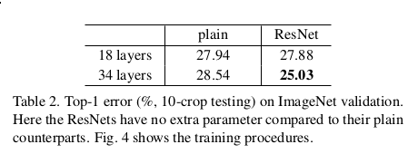
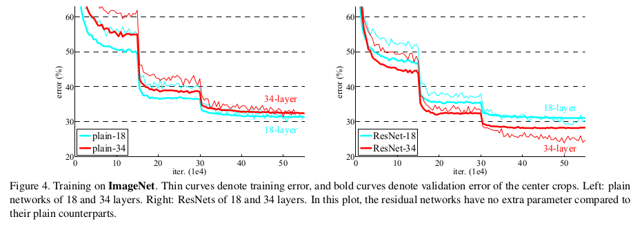
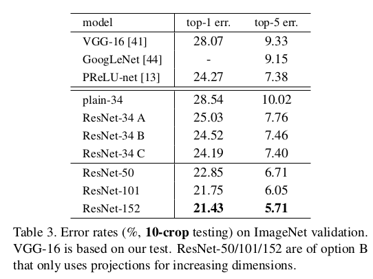
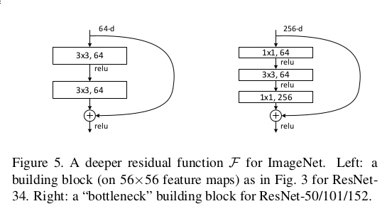

## Resnet 论文笔记

[TOC]

---

### 1. 摘要

众所周知，深度神经网络非常的难以训练。论文从另一个视角解释了郑重现象的原因，并提出了一种新的深度神经网络架构 - **深度残差网络**，通过实践证明，将原先的 CNN 中的卷积层改写成为残差层之后该网络架构可以有效的优化深度神经网络，并在 ImageNet 和其他的计算机视觉任务重获得了非常优秀的成绩。

深度残差网络的效果:

* 更容易优化
* 模型的深度越高，模型的效果越好
* 模型的深度增加但是复杂度降低

>We need to go deeper !

---

### 2. 简介

深度卷积神经网络在计算机视觉方面不断的突破性技术使得算法可以在端到端的学习过程中有效的收集到数据中的更多的特征(低，中，高)。模型的深度可以丰富特征的收集，最近的大量工作向我们揭示了网络的深度对网络的性能的重要性。

但是这引出来一个很严重的问题，随着网络的深度增加，网络是否变得更加容易去训练？这就是非常著名的梯度下降和梯度爆炸的问题。当代的深度学习研究人员已经发明出了类似于 **归一化(BN)** 的方法保证网络在做梯度下降的时候最前面的几层可以有效的收敛。

但是在大量的实践中，论文中的实验会发现这样一个有趣的现象。

当我们加大网络的层数进行训练，得到的 **训练误差** 反而有所上升，显而易见这并不是过拟合引起的。并且模型的表现( **测试误差** )也很不理想。说明之前的 **归一化** 的方案并不具备解决梯度小时的问题的能力。

这说明并不是所有的系统都可以有效的被优化。在这里我们引入一个典型的情况来进行考虑。我们存在有两个模型，一个是深度浅的网络模型，另一个是深度更深的模型（这里的的一部分层是浅模型的副本，其他的添加的层学习的都是恒等映射 $$f(x) = x$$ ，因为是恒等映射，`实际上深度模型最多也只能和浅模型的表现能力一致`)。但是实际上，深模型并不能保证效果可以维持和浅模型一致或者比浅模型更好。(现有的优化方案 (**归一化**) 无法让深模型的损失保持和原模型一致或者说更低)

论文中为了解决上述提出的问题，提出了深度残差网络架构，架构核心如下。

假设需要从上一层中学习到的映射是 $$H(x)$$，在这里并不直接的去学习 $$H(x)$$，而是学习残差 $$F(x):=H(x) - x$$，这样原来的要学习到的映射 $$H(x)$$，就会变成 $$F(x) + x$$，实验证明学习残差比学习原本的 $$H(x)$$ 会更加的容易 (极端的考虑，如果我们要学习的最优映射就是恒等映射的话，可以直接将残差学习成 0 来保证，并且这样会更加的容易)   正则化 ?

正如上图所示，我们在残差块中引入了 **跳远连接** ，并且这样的连接是恒等的，并不尝试去学习其他的非线性映射(不增加模型的复杂度)，最后直接的加在输出层上。这样的网络架构还非常的容易被其他的库实现和。

在 ImageNet 上的成绩的思考

* 深度残差网络很容易优化，但是没有使用残差块的网络会出现训练误差上升的情况
* 深度残差网络随着深度的增加，模型的精度可以有效的提升
* 模型深度很深，但是网络的参数复杂度并不提高
* 这样的效果并不局限于某一个具体的数据集上，模型的的表现性能可以很容易的扩展

---

### 3. 相关工作

学习残差函数的想法已经被研究了很长的一段时间了，其中一个非常著名的就是 `highway network`，该网络和深度残差网络非常的相似，但是在跳远连接中，`highway network` 中加入了门机制，并且门是数据依赖的，当只有当门开启的时候才会学习残差块，门中存在有大量的参数。但是反观深度残差网络，跳远连接是恒等映射并不存在其他的模型参数，并且深度残差网络的跳远连接始终开启。

更重要的一点是，`highway networks` 并没有从深度的增加中收获到精度的提升。

---

### 4. 深度残差学习

#### 4.1 残差学习

假设一部分的堆叠层需要学习的非线性函数映射是 $$H(x)$$，$$H(x) = F(x) + x$$ (这里假设 $$F(x)$$ 和 $$x$$ 拥有相同的维度)，通过学习 $$F(x)$$ 残差来实现学习原本的映射 $$H(x)$$，并且实验证明学习残差比学习原本的函数更容易。

虽然我们在简介中提到了，如果最优的映射是恒等映射的话，$$F(x)$$ 学习成 0 可以很容易的实现这一点，但是在实际中 $$F(x)$$ 学习的并不是 0 所以说残差块可以学习到额外的特征。

#### 4.2 跳远连接和恒等映射

残差块公式
$$
\sigma{(y)}=\sigma{(F(x,\{W_i\}) + x)}
$$
其中 $$x，y$$ 分别是输入向量和输出向量，$$F$$ 表示残差映射，$$\sigma$$ 表示激活函数，从上面的残差学习公式中我们可以看出来实际上残差块并没有引入新的参数，在和等深的深度网络的对比中我们可以发现这一点对于网络的优化和处理是非常有帮助的。

需要注意的是 $$F + x$$ 中的计算是按照元素相加的，正如上图所示，在相加之后在进行非线性激活运算。

* $$x$$ 和 $$F$$ 向量的大小是相同的，如果计算之后得到的 $$F$$ 和 $$x$$ 的规模不同的话，可以对 $$x$$ 做线性变换得到下面的式子
  $$
  y=F(x, \{W_i\})+ W_sx
  $$
  其中的 $$W_s$$ 中对恒等映射引入了参数只是为了保持残差的公式的维度的上的统一

* 残差块中的 $$F$$ 映射是很灵活的，在论文中 $$F$$ 是 2 ~ 3 层的卷积层的堆叠，更多的层数也是可能的，但是 1 层并没有什么作用

* 对应卷积网络来说，其中的残差块和恒等映射的相加也是针对元素的，但是每个通道都会做同样的计算

#### 4.3 网络架构

在论文中，作者将VGG-19，深度卷积网络，深度残差网络进行对比，引出了深度残差网络的基本架构

* Plain Network: 

  使用 VGG-19 网络作为其中一个对比参照，如上图左边的网络架构

  * 输出的特征图大小相同的话，卷积核数目相同
  * 输出的特征图的大小减半的话，卷积核的数目扩大为 2 倍保证复杂度
  * 下采样(池化)的步长是 2
  * 网络最后使用全局平均池化和一个 1000 大小的全连接网络 + softmax 对接
  * 和标准的 VGG 网络相比复杂度小，只有原来的 VGG 的计算量的 18%

* 残差网络:

  基于 Plain Network 加入了跳远连接，如上图右边

  * 当输入和输出的维数是相同的时候可以直接将恒等相加
  * 当输入和输出的维数不同(上图的点线)相加存在两种方案可选
    1. 不引入其他的参数，使用 0 填充额外的维度
    2. 使用 1 * 1 的卷积修正维度，引入了参数，但是这里引入的参数并不是模型相关的。

* CNN:

  上图中间的 CNN 网络是非常基础的网络架构，但是在应对梯度的方面效果并不是很好，只有残差网络真正的解决了这些问题。

#### 4.4 代码实现

参加 ImageNet 的比赛中，作者的团队还是用了其他的方案扩增数据集提高样本的数量，但是基本的网络架构还是深度残差网路。这一部分，论文只是解释了实现方面的细节，详情参见论文。

---

### 5. 实验分析

* Plain Networks:

  作者测试了 fig3 中的标准网络架构，并实现了18层和34曾层两种不同的深浅版本。

  

  正如上图所示，34层的网络和18层的网络相比有更大的验证误差，但是这一问题在残差网络上并不存在，虽然18层网络的解空间是34层的解空间的子集，但是相比而言34层的网络并没有得到很好的训练。

  **作者认为，这个原因并不是梯度消失引起的，因为在试验中作者采用了 BN 避免了这一点，作者认为主要原因在于训练的过程中收敛速度太慢才是主要的原因，但是并不确定，需要继续研究。**

* 残差网络

  

  如上图所示，使用了残差网络之后，不仅解决了网络的深度导致的问题，可以看到，验证集的误差也被降低，说明实验的效果是非常的理想，可以推广在其他的数据集上(模型的效果并不是针对某一个单独的数据的)。并且上图的表中，34层的残差网络的效果远远好于18层的网络。

  作者在论文中还描述了，使用残差网络的训练速度也会很高，收敛更快。

* 关于恒等映射和跳远连接的一些其他的想法

  对于修正维度的方面，作者的三个想法如下

  

  * A: 0 填充
  * B: 增加维度的跳远连接才使用线性变换，其他的时候恒等
  * C: 所有的跳远连接都加上了线性变换

  作者比较倾向于使用 B 的方案，引入了相对很少的和模型无关的参数，降低复杂性的同事保证了残差学习的效果

* 深度瓶颈架构

  作者在这里仔细的解释了为 ImageNet 准备的瓶颈残差网络架构，但是作者认为正常的残差网络架构也是很好的，但是为了获得更好的训练速度，作者在这里也做了一些优化。

  

  作者使用了3层的卷积层构建残差块，卷积核的大小分别是 $$1* 1, 3*3,1*1$$ ，$$1*1$$ 目的是减少和扩增是被的维度，但是上述的两种残差块的复杂度都是一样的。深度瓶颈架构中输入的数据维度是256，输出的数据的维度是256，中间的数据维度是64。但是跳远连接始终保持是恒等映射(没有池化的)，这也是残差网络的成功之处，恒等映射保证了高效的瓶颈架构。

* 网络过深也容易导致过拟合，在论文中作者疯狂的尝试了1202层的网络架构和110层相比有近乎一样的训练误差，但是实际上效果并不好，作者认为是因为导致了模型过拟合(1202层网络的参数空间已经达到了问题的上限)。

---

### 6. 残差网络优秀的解释

$$
y_l=h(x_l) + F(x_l,W_l)\\
x_{l+1}=f(y_l)
$$

上式中，$$x_l,x_{l+1}$$ 分别表示的是第 $$l,l+1$$ 的残差块的输入，每一个残差块都是一个多层(2~3)卷积层的堆叠结果。$$F$$ 是残差函数，表示学习到的残差，$$h(x_l)$$ 表示恒等映射，$$f$$ 表示激活函数，基于上式，可以得到从 $$l$$ 到 $$L$$ 这一个残差块内的公式。
$$
x_L=x_l+\sum_{i=1}^{L-1}F(x_i,W_i)
$$
利用链式法则计算反向传播的梯度可以得到
$$
\frac{\mathrm{d loss}}{\mathrm{x_l}}=\frac{\mathrm{d}loss}{\mathrm{d}x_L}\cdot\frac{\mathrm{d}x_L}{\mathrm{d}x_l}=\frac{\mathrm{d}loss}{\mathrm{d}x_L}\cdot(1+\frac{\mathrm{d}}{\mathrm{d}x_l}\sum_{i=1}^{L-1}F(x_i,W_i))
$$
可以看到，小括号内的梯度可以保证是1左右，这是短路机制保证的，而另外的残差的梯度不会很巧的是-1并且因为如果加上正则化项的话，残差的梯度很有可能会接近 0 这也保证了残差网络的训练的速度快，收敛快的特点。